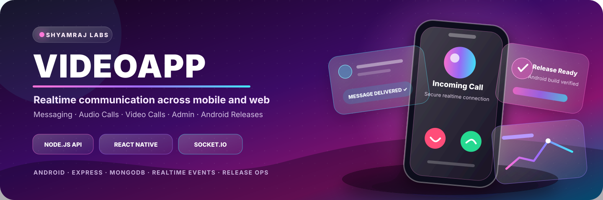
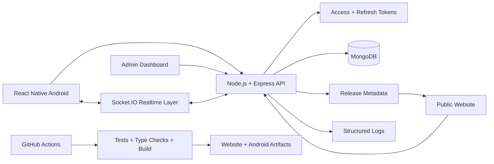
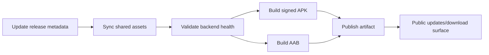

<p align="center">
  
</p>

<p align="center">
  
  
  
  
</p>

<p align="center">
  <a href="#-communication-experience">Experience</a> ·
  <a href="#-platform-architecture">Architecture</a> ·
  <a href="#-monorepo-universe">Structure</a> ·
  <a href="#-local-launch">Setup</a> ·
  <a href="#-android-release-engine">Releases</a> ·
  <a href="#-production-checklist">Production</a>
</p>

<h1 align="center">VIDEOAPP</h1>
<h3 align="center">A multi-surface communication product for messaging, audio/video calls, Android delivery and platform operations.</h3>

<p align="center">
  VideoApp combines a Node.js backend, React Native Android client, public website, admin dashboard, realtime events and release tooling inside one production-minded monorepo.
</p>

---

## ✨ Communication Experience

<table>
<tr>
<td width="33%" valign="top">

### 💬 Realtime Messaging

Socket-driven communication foundations with delivery events, session-aware authentication and mobile-first interaction flows.

</td>
<td width="33%" valign="top">

### 📞 Audio + Video Calls

Communication architecture designed for incoming, outgoing and active call states across mobile and web surfaces.

</td>
<td width="33%" valign="top">

### 📱 Android Product Layer

React Native client, environment-aware builds, release metadata and production APK configuration.

</td>
</tr>
<tr>
<td width="33%" valign="top">

### 🛡️ Admin Operations

System statistics, user controls, bans, announcements, releases and operational log visibility.

</td>
<td width="33%" valign="top">

### 🌍 Public Website

Landing experience, updates, FAQ, testimonials, SEO and APK release/download surfaces.

</td>
<td width="33%" valign="top">

### 🚀 Release Automation

CI verification, Android artifacts, shared release metadata, minimum supported versions and deployment tooling.

</td>
</tr>
</table>

## 🎛️ Product Control Matrix

| Product area | User-facing capability | Engineering layer |
|---|---|---|
| **Authentication** | Secure login and device sessions | Access tokens, refresh tokens and revocation |
| **Messaging** | Realtime conversations and delivery events | Socket.IO event layer |
| **Calling** | Audio/video communication flows | Mobile call states and realtime signaling foundations |
| **Mobile** | Android-first app experience | Expo React Native and environment embedding |
| **Administration** | User, release and system controls | Protected admin APIs and dashboard |
| **Public releases** | Updates, changelogs and APK information | Shared metadata and website synchronization |
| **Security** | Safer uploads and session control | Rate limiting, stricter validation and structured logs |
| **Delivery** | Repeatable production builds | Docker, CI, Caddy and hosting-provider configs |

## 🌐 Platform Architecture



## 🧬 Monorepo Universe

```text
.
├── backend/      # Node.js, Express, MongoDB and Socket.IO API
├── mobile/       # Expo React Native Android client
├── website/      # Landing, updates, downloads and admin dashboard
├── shared/       # Product copy and Android release metadata
├── deploy/       # Docker, VPS and Caddy assets
└── .github/      # CI, website deployment and Android release workflows
```

| Folder | Why it exists |
|---|---|
| `backend/` | Authentication, messaging, realtime events, admin APIs, releases and logs |
| `mobile/` | Android client, build profiles and runtime endpoint configuration |
| `website/` | Public product surface, updates and admin dashboard |
| `shared/` | One source of truth for release metadata and reusable content |
| `deploy/` | VPS deployment and reverse-proxy configuration |
| `.github/` | Automated verification, website deployment and Android release workflows |

## ⚡ Core Capabilities

### Communication and identity

- Realtime messaging through Socket.IO
- Access and refresh-token authentication
- Device sessions and session revocation
- Audio/video call foundations
- Mobile-first interaction flow

### Administration and moderation

- System statistics
- User bans and moderation controls
- Announcements
- Android release management
- Operational log viewing

### Public product experience

- Marketing landing page
- Product updates and changelog page
- APK download information
- Live download counts
- Testimonials and FAQ
- SEO-oriented pages

### Security and delivery

- Rate limiting
- Stricter upload handling
- Structured application logs
- Environment-separated configuration
- Docker and reverse-proxy deployment
- CI and release automation

## 🪐 Technology Stack

<p align="center">
  
</p>

| Layer | Technologies |
|---|---|
| **Backend** | Node.js, Express, MongoDB and Socket.IO |
| **Mobile** | Expo, React Native and Android build configuration |
| **Website** | Public site, updates and administration surfaces |
| **Security** | JWT-style access/refresh flows, rate limits and session revocation |
| **Operations** | Docker, PM2, Caddy, GitHub Actions and provider configs |

## ⚙️ Local Launch

<details open>
<summary><strong>1 — Install project dependencies</strong></summary>

```bash
npm install
npm install --prefix website
npm install --prefix mobile
```

</details>

<details open>
<summary><strong>2 — Configure environments</strong></summary>

Windows:

```powershell
copy .env.example .env
```

Review:

- `website/.env.development`
- `website/.env.production`
- `mobile/.env.development`
- `mobile/.env.production`

The backend expects `MONGO_URI` and uses port `3000` by default.

</details>

<details open>
<summary><strong>3 — Start backend and website</strong></summary>

```bash
npm run dev:backend
npm run dev:website
```

</details>

<details open>
<summary><strong>4 — Start mobile development</strong></summary>

```bash
npm run dev:mobile
```

</details>

## 🧱 Environment Layering

The backend loads configuration in this order:

1. `.env`
2. `.env.<NODE_ENV>`
3. `.env.local`
4. `.env.<NODE_ENV>.local`

This keeps local overrides separate from staging and production values.

## 🛡️ Admin Command Center

| Route | Purpose |
|---|---|
| `/` | Public landing page |
| `/updates` | Updates and release notes |
| `/admin/login` | Administrator authentication |
| `/admin` | Operational dashboard |

Admin variables:

```text
ADMIN_EMAIL=...
ADMIN_PASSWORD_HASH=...
ADMIN_JWT_SECRET=...
```

Generate a password hash:

```bash
npm run admin:hash-password -- "YourStrongPassword"
```

## 📲 Android Release Engine



Update metadata:

```bash
npm run release:android -- --version 1.1.0 --build 12 --apk-url https://example.com/videoapp.apk --min-supported 10 --notes "Security hardening|Admin dashboard|Force update support"
```

Sync shared assets:

```bash
npm run sync:shared-assets
```

Build Android artifacts:

```bash
npm run build:android:apk --prefix mobile
npm run build:android:aab --prefix mobile
```

Direct EAS production build:

```bash
eas build -p android --profile production
```

The project APK command is recommended because it validates `/health` before upload. `mobile/app.config.js` embeds production endpoints into the installed application configuration.

## 🚢 Deployment Matrix

| Component | Targets |
|---|---|
| Website | GitHub Pages, Netlify or Vercel |
| Backend | Render, Railway or VPS Docker |
| Database | MongoDB Atlas or another managed MongoDB service |
| Reverse proxy | Caddy-based VPS configuration |
| Process manager | PM2 |

Included assets:

- `render.yaml`
- `website/netlify.toml`
- `website/vercel.json`
- `deploy/docker-compose.vps.yml`
- `deploy/Caddyfile`
- `.github/workflows/ci.yml`
- `.github/workflows/deploy-website.yml`
- `.github/workflows/android-release.yml`

## 🔁 Process Management

```bash
npm run start:backend:pm2
```

## ✅ Verification Suite

```bash
npm run verify
```

The verification command covers:

- Backend tests
- Mobile TypeScript checks
- Website production build

## 🗺️ Product Roadmap

- [x] Production-minded monorepo structure
- [x] Backend authentication and device sessions
- [x] Realtime Socket.IO foundation
- [x] Admin and release APIs
- [x] Public website and updates surface
- [x] Docker and CI assets
- [x] Android release metadata workflow
- [ ] Expanded automated communication tests
- [ ] Stronger realtime observability
- [ ] Broader device and background-state verification

## 🏭 Production Checklist

- Replace placeholder domains in `website/public/sitemap.xml`.
- Keep production credentials outside the repository.
- Use managed MongoDB with backups and network restrictions.
- Publish only signed Android artifacts.
- Synchronize release metadata before publishing.
- Verify API and socket endpoints in production builds.

---

<p align="center">
  <strong>Designed and engineered by Shyamraj.</strong><br/>
  <sub>Realtime systems · Android products · Full-stack communication</sub>
</p>
