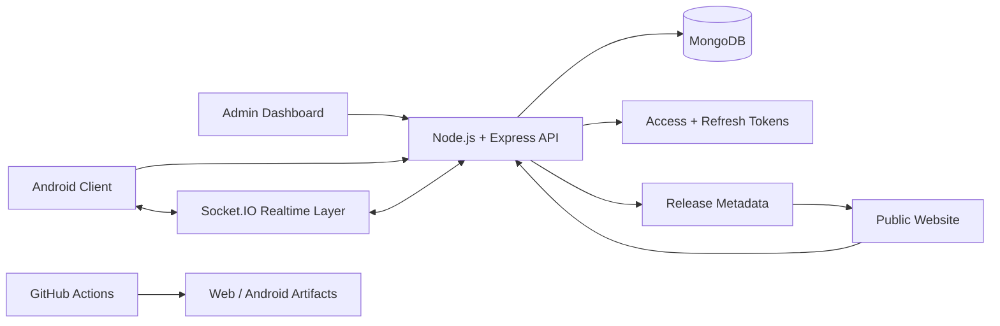

<p align="center">
  
</p>

<p align="center">
  
  
  
  
</p>

<h1 align="center">VideoApp</h1>
<p align="center"><strong>A production-minded communication monorepo for messaging, audio/video calling, Android delivery, public releases and administration.</strong></p>

> **Project status:** active development. This repository is organized as a multi-surface product with backend, mobile, website, shared assets and deployment tooling.

## Product overview

VideoApp brings the main parts of a modern communication platform into one repository:

| Surface | Responsibility |
|---|---|
| **Backend** | Authentication, sessions, messaging, realtime events, administration, releases and logs |
| **Mobile** | Expo React Native Android client and production build configuration |
| **Website** | Public landing page, updates, APK release surface and admin dashboard |
| **Shared** | Reusable product copy and Android release metadata |
| **Deployment** | Docker, Caddy, CI and hosting-provider configuration |

## Architecture



## Core capabilities

### Communication platform

- Realtime messaging through Socket.IO
- Android-focused communication client
- Audio/video communication foundations
- Device sessions with access and refresh tokens
- Session revocation and structured authentication flows

### Operations and administration

- Admin APIs for system statistics
- User bans and moderation controls
- Announcements and Android release management
- Log viewing and operational visibility
- Release notes, minimum supported build and force-update metadata

### Public product surface

- Marketing landing page
- Updates and release-notes page
- APK download and release metadata
- Live download counts
- Testimonials, FAQ and SEO-oriented public pages

### Delivery and security

- Rate limiting and upload restrictions
- Environment-specific configuration layers
- Docker and reverse-proxy deployment scaffolding
- CI verification and Android release workflows
- Production secret separation from committed source files

## Repository structure

```text
.
├── backend/      # Node.js, Express, MongoDB and Socket.IO API
├── mobile/       # Expo React Native Android client
├── website/      # Public site, updates and admin dashboard
├── shared/       # Shared copy and Android release metadata
├── deploy/       # VPS, Docker and Caddy deployment assets
└── .github/      # CI, website deployment and Android release workflows
```

## Local development

### Requirements

- Node.js and npm
- A reachable MongoDB instance
- Expo tooling for mobile development

### 1. Install dependencies

```bash
npm install
npm install --prefix website
npm install --prefix mobile
```

### 2. Configure environment files

```powershell
copy .env.example .env
```

Review the environment files for each runtime:

- `website/.env.development`
- `website/.env.production`
- `mobile/.env.development`
- `mobile/.env.production`

### 3. Start backend and website

```bash
npm run dev:backend
npm run dev:website
```

The backend expects a real MongoDB connection through `MONGO_URI` and uses port `3000` by default.

### 4. Start the mobile client

```bash
npm run dev:mobile
```

## Environment loading order

The backend loads configuration in this order:

1. `.env`
2. `.env.<NODE_ENV>`
3. `.env.local`
4. `.env.<NODE_ENV>.local`

Templates are included for development, staging and production environments.

## Admin dashboard

| Route | Purpose |
|---|---|
| `/` | Public landing page |
| `/updates` | Product updates and release notes |
| `/admin/login` | Administrator login |
| `/admin` | Administration dashboard |

Admin authentication uses:

```text
ADMIN_EMAIL=...
ADMIN_PASSWORD_HASH=...
ADMIN_JWT_SECRET=...
```

Generate a password hash:

```bash
npm run admin:hash-password -- "YourStrongPassword"
```

## Android release workflow

Update shared Android release metadata:

```bash
npm run release:android -- --version 1.1.0 --build 12 --apk-url https://example.com/videoapp.apk --min-supported 10 --notes "Security hardening|Admin dashboard|Force update support"
```

Sync shared release assets into the website:

```bash
npm run sync:shared-assets
```

Build Android artifacts:

```bash
npm run build:android:apk --prefix mobile
npm run build:android:aab --prefix mobile
```

Direct EAS production build:

```bash
eas build -p android --profile production
```

The recommended project command remains `npm run build:android:apk --prefix mobile` because it validates the backend health endpoint before upload. Production environment values are embedded through `mobile/app.config.js` so installed builds keep the correct API and socket endpoints.

## Deployment targets

| Component | Supported targets |
|---|---|
| Website | GitHub Pages, Netlify or Vercel |
| Backend | Render, Railway or VPS Docker deployment |
| Database | MongoDB Atlas or another managed MongoDB service |

Included deployment assets:

- `render.yaml`
- `website/netlify.toml`
- `website/vercel.json`
- `deploy/docker-compose.vps.yml`
- `deploy/Caddyfile`
- `.github/workflows/ci.yml`
- `.github/workflows/deploy-website.yml`
- `.github/workflows/android-release.yml`

## Process management

Run the API with PM2:

```bash
npm run start:backend:pm2
```

## Verification

Run the complete project verification suite:

```bash
npm run verify
```

The verification path covers:

- Backend tests
- Mobile TypeScript checks
- Website production build

## Production checklist

- Replace placeholder domains in `website/public/sitemap.xml`.
- Store all production secrets in the hosting provider or GitHub Actions secrets.
- Use a managed MongoDB instance with backups and access controls.
- Publish only signed Android artifacts.
- Keep release metadata synchronized between shared assets and the public website.

---

<p align="center"><strong>Designed and engineered by Shyamraj.</strong></p>
